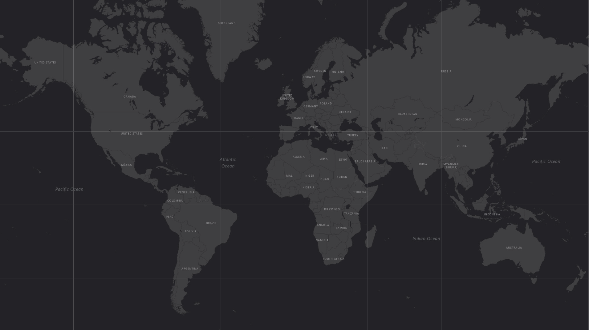

# Location History Plotter

A powerful, privacy-focused web application to visualize your Google Takeout Location History (`Timeline.json`) on an interactive, high-performance world map.



## 🚀 Features

*   **Interactive Visualization**:
    *   **High Performance**: Uses Canvas rendering to handle millions of data points smoothly.
    *   **Customizable**: Adjust dot size, switch map providers (Dark, Light, Satellite, etc.), and toggle between Single Color or Multi-Color (by year) modes.
    *   **Filtering**: View all years at once or filter by specific years.
*   **Automated Workflow**:
    *   **Drag & Drop**: Simple upload interface.
    *   **Auto-Save**: Automatically generates and saves a high-res screenshot of your map after rendering.
    *   **Download**: One-click download of your map as a PNG.
*   **Privacy & Security**:
    *   **Ephemeral Storage**: Uploaded JSON files are **deleted immediately** after processing.
    *   **Auto-Cleanup**: Generated maps and processed data are automatically purged from the server after 1 hour.
    *   **Session Isolation**: User data is isolated with unique session IDs to prevent data mixing in multi-user environments.

## 🛠️ Installation & Local Development

1.  **Prerequisites**:
    *   Python 3.8+
    *   pip

2.  **Clone the repository**:
    ```bash
    git clone <your-repo-url>
    cd location-history-plotter
    ```

3.  **Install Dependencies**:
    ```bash
    pip install -r requirements.txt
    ```

4.  **Run the Application**:
    ```bash
    python backend/app.py
    ```

5.  **Access**:
    Open your browser and navigate to `http://127.0.0.1:5000`.

## ☁️ Deployment

This project is configured for easy deployment on platforms like **Render** or **Heroku**.

### Deploy on Render (Recommended)
1.  Push your code to a GitHub repository.
2.  Create a new **Web Service** on Render.
3.  Connect your repository.
4.  Render will automatically detect the `Procfile` and `requirements.txt`.
5.  **Build Command**: `pip install -r requirements.txt`
6.  **Start Command**: `gunicorn backend.app:app`

## 📖 Usage

1.  **Get your Data**:
    *   Go to [Google Takeout](https://takeout.google.com/).
    *   Deselect all, then select **Location History (Timeline)**.
    *   Download and extract the zip file to find `Timeline.json` (or `Records.json`).
2.  **Upload**:
    *   Drag and drop the JSON file onto the web page.
3.  **Explore**:
    *   Wait for the processing to finish (large files may take a moment).
    *   Use the controls to change colors, map styles, and dot sizes.
4.  **Save**:
    *   The map is automatically saved to the server upon rendering.
    *   Click "Download Map" to save a copy to your device.

## 🏗️ Tech Stack

*   **Backend**: Python, Flask, Pandas, Matplotlib
*   **Frontend**: HTML5, CSS3, JavaScript, Leaflet.js
*   **Server**: Gunicorn (for production)

## 🔒 Privacy Note

This application is designed with privacy in mind. When hosted, it does **not** permanently store your location history.
*   **Source JSON**: Deleted immediately after parsing.
*   **Processed Data**: Deleted automatically after 1 hour.
*   **Maps**: Deleted automatically after 1 hour.

---
*Created for personal visualization and data exploration.*
